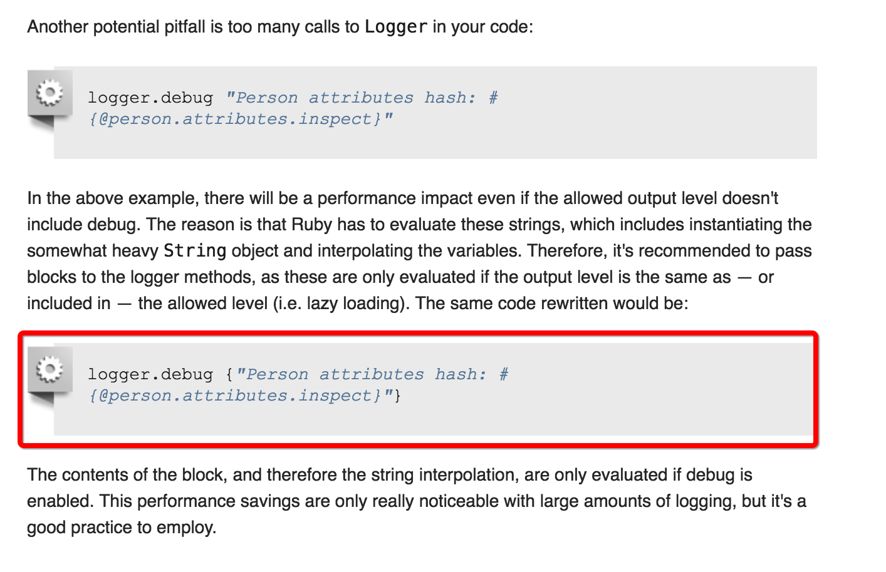

### 为了保持编码风格一致性，使程序易于维护

1. 源文件编码  
   >使用utf-8，ruby > 2.0已经默认使用该编码。如果ruby < 2.0 请使用如下方式指定

	 ```
	 ① # coding: utf-8
	 ② # encoding: utf-8
	 ③ # -*- coding: utf-8 -*-	
	 ```
2. frozen_string_literal
	 在源文件第一行使用frozen_string_literal，如果ruby>=2.3会自动使用该功能
   > #frozen_string_literal: true  
	 [参考](https://freelancing-gods.com/2017/07/27/an-introduction-to-frozen-string-literals.html)

3. 字符串非特殊情况一律使用双引号

4. 方法之间添加一个空行

5. 使用两个空格缩进

6. 文件末尾不需要空行

7. private 空一行

    


----

### rails
 
  1. 使用日志，日志内容使用代码块代替字符串参数
	 

使用 [rubocop](https://github.com/rubocop-hq/rubocop)检查编码风格